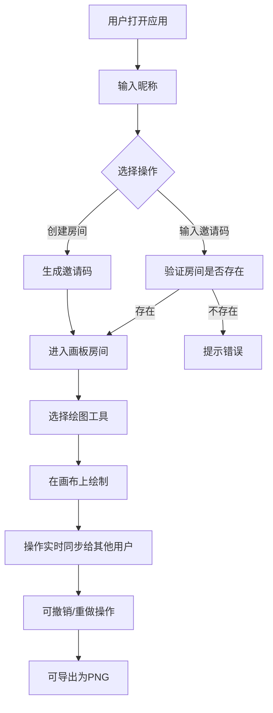
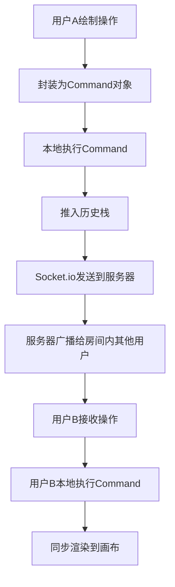

## 1. 产品概述

多人实时协作在线画板 Web 应用，支持多人同时在同一画布上进行绘图创作，实时同步所有操作。解决远程团队协作绘图、在线教学白板、创意头脑风暴等场景需求。

- 核心价值：零配置、低延迟的实时协作绘图体验
- 目标用户：设计师、教师、远程团队、创意工作者

## 2. 核心功能

### 2.1 用户角色

| 角色 | 注册方式 | 核心权限 |
|------|----------|----------|
| 普通用户 | 无需注册，输入昵称即可使用 | 创建房间、加入房间、使用所有绘图工具 |

### 2.2 功能模块

1. **首页/房间入口**：创建房间、加入房间、昵称输入
2. **画板主界面**：绘图工具栏、图层面板、在线用户列表、画布区域
3. **绘图系统**：画笔、橡皮擦、直线、矩形、圆形、文字输入
4. **图层系统**：最多5个图层，切换、可见性控制、删除
5. **历史记录**：撤销（Undo）、重做（Redo），记录操作者
6. **实时协作**：Socket.io 实时同步、光标位置显示、在线用户列表
7. **导出功能**：导出画布为 PNG 图片

### 2.3 页面详情

| 页面名称 | 模块名称 | 功能描述 |
|----------|----------|----------|
| 首页 | 房间入口 | 昵称输入、创建房间按钮、输入邀请码加入房间 |
| 画板页 | 工具栏 | 画笔（粗细/颜色）、橡皮擦、直线、矩形、圆形、文字、撤销、重做、导出 |
| 画板页 | 图层面板 | 图层列表、切换当前图层、可见性切换、删除图层 |
| 画板页 | 在线用户列表 | 显示当前房间用户、光标位置实时同步 |
| 画板页 | 画布区域 | 多层 Canvas 叠加、实时渲染协作内容 |

## 3. 核心流程

### 用户主要流程

### 协作同步流程

## 4. 用户界面设计

### 4.1 设计风格

- **主色调**：深蓝 (#1e3a5f) 作为品牌色，搭配浅灰背景和白色面板
- **辅助色**：翠绿 (#10b981) 用于操作按钮，橙红 (#ef4444) 用于警告/删除
- **按钮风格**：圆角 6px，轻微阴影，hover 状态有微缩放和颜色加深
- **字体**：主字体使用 "Inter"，等宽字体用于显示邀请码
- **布局风格**：三栏布局 - 左侧工具栏、中间画布、右侧面板（图层+用户列表）
- **视觉细节**：画布区域带轻微网格背景，面板有毛玻璃效果

### 4.2 页面设计概述

| 页面名称 | 模块名称 | UI 元素 |
|----------|----------|----------|
| 首页 | 房间入口 | 居中卡片、昵称输入框、创建按钮、邀请码输入框、加入按钮、渐变背景 |
| 画板页 | 工具栏 | 垂直排列图标按钮、工具选中高亮、颜色选择器、粗细滑块 |
| 画板页 | 图层面板 | 图层卡片、眼睛图标切换可见性、垃圾桶图标删除、当前图层高亮 |
| 画板页 | 用户列表 | 用户头像+昵称、实时光标点（带用户名标签） |
| 画板页 | 画布区域 | 网格背景、可绘制区域、多层 Canvas 叠加 |

### 4.3 响应性

- 桌面端为主要设计目标（1280px 以上）
- 平板端：工具栏改为水平排列在顶部，右侧面板可折叠
- 移动端：基础功能可用，优先保证绘图体验

### 4.4 交互细节

- 工具切换有平滑过渡动画
- 图层操作有淡入淡出效果
- 撤销/重做按钮在不可用时显示禁用状态
- 用户加入/离开房间有 toast 提示
- 光标跟随有轻微延迟平滑效果
