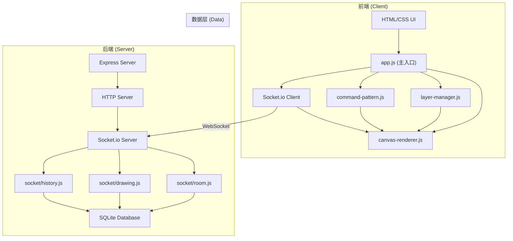

## 1. 架构设计



## 2. 技术描述

### 2.1 前端技术栈
- **HTML5**：页面结构，使用语义化标签
- **CSS3**：样式设计，使用 CSS 变量、Flexbox、Grid
- **原生 JavaScript (ES6+)**：业务逻辑，无框架
- **Canvas 2D API**：绘图渲染，多层 Canvas 叠加
- **Socket.io Client**：实时通信

### 2.2 后端技术栈
- **Node.js**：运行环境
- **Express.js**：Web 框架，提供静态文件服务
- **Socket.io**：实时双向通信
- **SQLite (better-sqlite3)**：轻量级数据库，存储房间信息和操作历史

### 2.3 项目结构

```
lzy-00006/
├── public/                     # 前端静态资源
│   ├── index.html             # 首页（房间入口）
│   ├── board.html             # 画板页面
│   ├── css/
│   │   ├── style.css          # 全局样式
│   │   └── board.css          # 画板页面样式
│   └── js/
│       ├── app.js             # 主入口，初始化和事件绑定
│       ├── layer-manager.js   # 图层管理逻辑
│       ├── canvas-renderer.js # Canvas 绑定和渲染
│       ├── commands.js        # 命令模式实现
│       └── socket-client.js   # Socket.io 客户端封装
├── server/
│   ├── server.js              # Express 服务器主入口
│   ├── db.js                  # SQLite 数据库连接
│   └── socket/
│       ├── index.js           # Socket.io 主处理器
│       ├── room.js            # 房间事件处理
│       ├── drawing.js         # 绘图事件处理
│       └── history.js         # 撤销/重做事件处理
├── package.json
└── README.md
```

## 3. 关键设计决策

### 3.1 命令模式 (Command Pattern)

```javascript
// commands.js - 命令接口
interface Command {
    execute(): void;
    undo(): void;
    getType(): string;
    getUserId(): string;
    getLayerId(): string;
    serialize(): object;
}

// 具体命令类
class DrawPathCommand implements Command { /* ... */ }
class DrawLineCommand implements Command { /* ... */ }
class DrawRectCommand implements Command { /* ... */ }
class DrawCircleCommand implements Command { /* ... */ }
class DrawTextCommand implements Command { /* ... */ }
class EraseCommand implements Command { /* ... */ }
```

- **历史栈管理**：`undoStack` 和 `redoStack` 两个栈结构
- **命令序列化**：所有命令可序列化后通过 Socket.io 传输
- **操作者记录**：每个命令携带 `userId` 和 `userName`

### 3.2 图层系统

```javascript
// layer-manager.js
class LayerManager {
    constructor(maxLayers = 5) { /* ... */ }
    addLayer(): Layer;
    removeLayer(layerId: string): boolean;
    setCurrentLayer(layerId: string): void;
    setLayerVisibility(layerId: string, visible: boolean): void;
    getLayers(): Layer[];
    getCurrentLayer(): Layer | null;
}

class Layer {
    constructor(id: string, name: string) { /* ... */ }
    clear(): void;
    getImageData(): ImageData;
    putImageData(data: ImageData): void;
}
```

- **最多 5 个图层**：限制图层数量保证性能
- **每个图层独立 Canvas**：离屏 Canvas 存储图层数据
- **图层 z-index 控制**：按数组顺序渲染，支持重排

### 3.3 Canvas 渲染

```javascript
// canvas-renderer.js
class CanvasRenderer {
    constructor(container: HTMLElement, layerManager: LayerManager) { /* ... */ }
    bindEvents(): void;
    render(): void;
    executeCommand(command: Command): void;
    undoCommand(): Command | null;
    redoCommand(): Command | null;
    exportToPNG(): string;
}
```

- **多层 Canvas 叠加**：显示层 + 预览层 + 各图层
- **离屏渲染**：图层数据存储在 OffscreenCanvas
- **预览绘制**：鼠标拖动时实时显示绘制预览

### 3.4 Socket.io 事件拆分

| 模块 | 事件名称 | 描述 |
|------|----------|------|
| **room.js** | `room:create` | 创建房间 |
| **room.js** | `room:join` | 加入房间 |
| **room.js** | `room:leave` | 离开房间 |
| **room.js** | `room:users` | 在线用户列表更新 |
| **room.js** | `cursor:move` | 光标位置同步 |
| **drawing.js** | `draw:command` | 绘图命令广播 |
| **drawing.js** | `draw:preview` | 绘制预览（可选） |
| **history.js** | `history:undo` | 撤销操作广播 |
| **history.js** | `history:redo` | 重做操作广播 |
| **history.js** | `history:sync` | 历史记录同步（新用户加入） |

## 4. 数据模型

### 4.1 数据库表结构

```sql
-- rooms 表：存储房间信息
CREATE TABLE rooms (
    id INTEGER PRIMARY KEY AUTOINCREMENT,
    code TEXT UNIQUE NOT NULL,
    created_at TIMESTAMP DEFAULT CURRENT_TIMESTAMP,
    expires_at TIMESTAMP
);

-- users 表：存储用户会话信息
CREATE TABLE users (
    id TEXT PRIMARY KEY,
    socket_id TEXT UNIQUE NOT NULL,
    room_code TEXT NOT NULL,
    name TEXT NOT NULL,
    color TEXT NOT NULL,
    joined_at TIMESTAMP DEFAULT CURRENT_TIMESTAMP,
    FOREIGN KEY (room_code) REFERENCES rooms(code)
);

-- commands 表：持久化房间操作历史
CREATE TABLE commands (
    id INTEGER PRIMARY KEY AUTOINCREMENT,
    room_code TEXT NOT NULL,
    user_id TEXT NOT NULL,
    user_name TEXT NOT NULL,
    command_type TEXT NOT NULL,
    layer_id TEXT NOT NULL,
    payload TEXT NOT NULL,  -- JSON 序列化的命令数据
    sequence INTEGER NOT NULL,
    created_at TIMESTAMP DEFAULT CURRENT_TIMESTAMP,
    FOREIGN KEY (room_code) REFERENCES rooms(code),
    FOREIGN KEY (user_id) REFERENCES users(id)
);
```

### 4.2 核心数据结构

```typescript
// 命令数据结构
interface CommandData {
    type: 'path' | 'line' | 'rect' | 'circle' | 'text' | 'erase';
    layerId: string;
    userId: string;
    userName: string;
    color?: string;
    lineWidth?: number;
    points?: { x: number; y: number }[];
    startX?: number;
    startY?: number;
    endX?: number;
    endY?: number;
    text?: string;
    fontSize?: number;
}

// 图层数据结构
interface Layer {
    id: string;
    name: string;
    visible: boolean;
    canvas: HTMLCanvasElement | OffscreenCanvas;
}

// 用户数据结构
interface User {
    id: string;
    socketId: string;
    name: string;
    color: string;
    cursorX: number;
    cursorY: number;
}
```

## 5. Socket.io 事件协议

### 5.1 房间事件 (socket/room.js)

```javascript
// 客户端 -> 服务器
socket.emit('room:create', { userName: string }, (response) => {
    // { success: boolean, roomCode: string, error?: string }
});

socket.emit('room:join', { roomCode: string, userName: string }, (response) => {
    // { success: boolean, users: User[], error?: string }
});

socket.emit('cursor:move', { x: number, y: number });

// 服务器 -> 客户端
socket.on('room:user-joined', { user: User });
socket.on('room:user-left', { userId: string });
socket.on('room:users', { users: User[] });
socket.on('cursor:update', { userId: string, x: number, y: number, name: string });
```

### 5.2 绘图事件 (socket/drawing.js)

```javascript
// 客户端 -> 服务器
socket.emit('draw:command', { command: CommandData });

// 服务器 -> 客户端
socket.on('draw:command', { command: CommandData, fromUserId: string });
```

### 5.3 历史事件 (socket/history.js)

```javascript
// 客户端 -> 服务器
socket.emit('history:undo');
socket.emit('history:redo');
socket.emit('history:sync', { roomCode: string });

// 服务器 -> 客户端
socket.on('history:undo', { commandId: number, userId: string });
socket.on('history:redo', { command: CommandData, userId: string });
socket.on('history:sync', { commands: CommandData[] });
```

## 6. 安全性与性能

### 6.1 安全考虑
- 输入验证：所有用户输入进行 XSS 过滤
- 房间邀请码：6 位随机字母数字，防止暴力破解
- 命令验证：服务器验证命令数据格式合法性
- 速率限制：限制单个用户发送命令的频率

### 6.2 性能优化
- Canvas 脏矩形渲染：只重绘变化区域
- 命令节流：鼠标移动事件节流处理
- 图层合并：导出时合并所有可见图层
- 数据库清理：定期清理过期房间数据
- 消息压缩：大命令数据使用压缩传输

### 6.3 错误处理
- 重连机制：Socket.io 自动重连，重连后同步历史
- 错误回调：所有 emit 事件包含错误处理回调
- 优雅降级：网络中断时显示离线状态，恢复后自动同步
