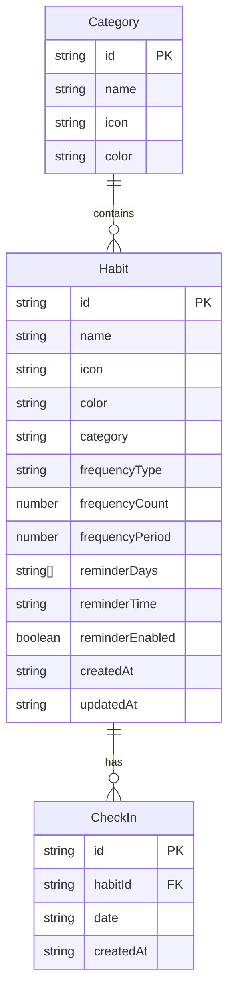

## 1. 架构设计

```mermaid
graph TB
    "前端 React App" --> "Zustand 状态管理"
    "Zustand 状态管理" --> "localStorage 持久化"
    "前端 React App" --> "Chart.js 图表库"
    "前端 React App" --> "Notification API"
    "前端 React App" --> "Blob API 数据导出"
```

纯前端应用，无后端服务。数据通过 localStorage 持久化存储在浏览器本地。

## 2. 技术说明

- **前端框架**：React 18 + TypeScript + Vite
- **样式方案**：Tailwind CSS 3
- **状态管理**：Zustand（带 persist 中间件实现 localStorage 持久化）
- **路由**：React Router DOM v6
- **图表库**：Chart.js + react-chartjs-2（交互式图表）
- **图标**：Lucide React
- **日期处理**：date-fns
- **数据导出**：原生 Blob API + FileSaver
- **通知**：Web Notification API
- **初始化工具**：vite-init

## 3. 路由定义

| 路由 | 用途 |
|------|------|
| / | 仪表盘页面 - 今日打卡概览和快速打卡 |
| /habits | 习惯管理页面 - 创建、编辑、删除习惯 |
| /calendar | 日历热力图页面 - 全年打卡可视化 |
| /stats | 统计分析页面 - 多维度数据图表 |
| /settings | 设置页面 - 提醒、导出、权限管理 |

## 4. API 定义

无后端 API，所有数据操作通过 Zustand store 直接读写 localStorage。

## 5. 服务端架构

不适用 - 纯前端应用

## 6. 数据模型

### 6.1 数据模型定义



### 6.2 数据定义语言

**Habit（习惯）**
```typescript
interface Habit {
  id: string
  name: string
  icon: string
  color: string
  category: string
  frequencyType: 'daily' | 'weekly' | 'monthly'
  frequencyCount: number
  frequencyPeriod: number
  reminderDays: number[]
  reminderTime: string
  reminderEnabled: boolean
  createdAt: string
  updatedAt: string
}
```

**CheckIn（打卡记录）**
```typescript
interface CheckIn {
  id: string
  habitId: string
  date: string
  createdAt: string
}
```

**Category（分类）**
```typescript
interface Category {
  id: string
  name: string
  icon: string
  color: string
}
```

**AppStore（全局状态）**
```typescript
interface AppStore {
  habits: Habit[]
  checkIns: CheckIn[]
  categories: Category[]
  addHabit: (habit: Habit) => void
  updateHabit: (id: string, updates: Partial<Habit>) => void
  deleteHabit: (id: string) => void
  checkIn: (habitId: string, date: string) => void
  uncheckIn: (habitId: string, date: string) => void
  addCategory: (category: Category) => void
  deleteCategory: (id: string) => void
  getStreak: (habitId: string) => number
  getTotalCheckIns: (habitId: string) => number
  getCheckInsByDate: (date: string) => CheckIn[]
  getCheckInsByDateRange: (start: string, end: string) => CheckIn[]
}
```
